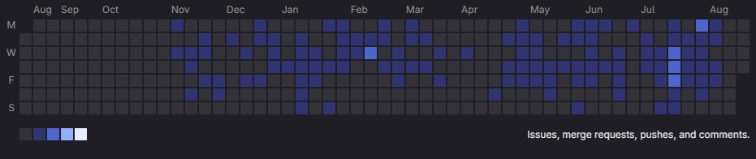
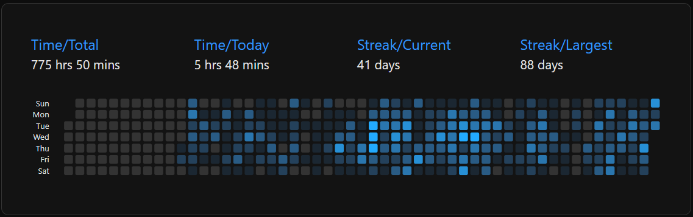

# Hi, I'm Achmad F. Ibrahim 👋

> Experienced mid-level Vue.js Front-end Developer with a full-stack experience.

I'm a mid-level Vue.js front-end developer with a full-stack experience, skilled 
in building scalable, maintainable web applications using Vue 3 and modern ES6 JavaScript. 
I am focused on creating seamless user experiences and high-quality UI components. 
I have collaborated closely with UI/UX teams to translate design mockups into fully 
functional front-end applications and have experience working alongside back-end teams to 
ensure smooth, efficient project delivery. 

I am currently seeking new opportunities to further develop my expertise in front-end development.

  
Contact and socials

   
  

    
    
    
  

---

  
Github activity and other statistics

  <h3>Github</h3>
  

    
  

  

    
    
  

  

    
    
  

  
  <h3>GitLab Project Under NDA for Government Work</h3>
  <figure>
     
    <!-- <figcaption>Gitlab Private Repository</figcaption> -->
  </figure>
  
  <h3>CodeTime</h3>
  

    

      
    

  

  
  
  <h3>Codeium AI</h3>
  

    

      
    

  

---

  
Ongoing or previous projects

   
  <ul>
    <li>
      <a href="https://www.org-engine.com" target="_blank">
        org-engine.com
      </a> - Company onboarding software
    </li>
  </ul>

---

  
Experiences

  
  ### Frontend

  * Build and maintain front-end UI based on Figma design
  * Build and maintain UI components using Vue 2 and Vue 3
  * Design and maintain UI using Tailwind CSS CSS framework
  * Build and maintain UX features such as drag and drop, element resizing, and zooming

  ### Backend

  * Build and maintain Ruby on Rails web applications and REST APIs
  * Create and maintain complex SQL queries and records in PostgreSQL

  ### DevOps

  * Set up and maintain Virtual Private Servers on cloud providers such as DigitalOcean
  * Set up and maintain Ubuntu Server Images to run web applications
  * Configure Nginx reverse proxy and SSL certificates
  * Build task and automation scripts using Bash
  * Set up development environments that closely resemble production.
  
  ---

  <h3>Languages</h3>
  

    
    
    
    
    
  

  <h3>Libraries or Frameworks</h3>
  

    
    
    
    
  

  <h3>Softwares</h3>
  

    
    
  

  <h3>Platforms</h3>
  

    
    
    
    
<!--      -->
  

  <h3>Development Environment and Tools</h3>
  

    
    
    
    
    
    
    
  

  <h3>Currently Exploring and Learning</h3>
<!--    -->
<!--    -->
<!--    -->
 
 
 
 
 
 

---

  
Past Experiences

   
  

    
    
    
    
    
    
    
    
    
    
    
    
    
  

<!--
**acfatah/acfatah** is a ✨ _special_ ✨ repository because its `README.md` (this file) appears on your GitHub profile.

Here are some ideas to get you started:

- 🔭 I’m currently working on ...
- 🌱 I’m currently learning ...
- 👯 I’m looking to collaborate on ...
- 🤔 I’m looking for help with ...
- 💬 Ask me about ...
- 📫 How to reach me: ...
- 😄 Pronouns: ...
- ⚡ Fun fact: ...
-->
