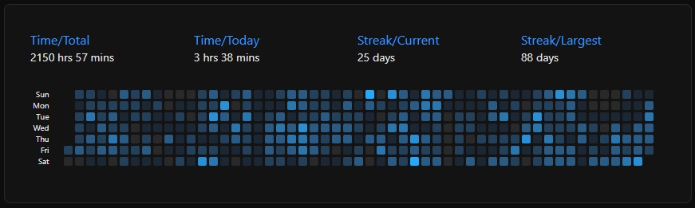

  <h1>Hi, I'm Achmad Fatah 👋</h1>

  
  
  
  
  

  <h3>Full-stack Bun TypeScript Web Developer | Vue.js Front-end Specialist</h3>

  
  
  

I’m a front-end-focused full-stack developer with 4+ years of hands-on 
experience — self-taught through real-world projects, deep experimentation, and 
continuous learning.

I’ve built my expertise through self-directed learning and practical 
experience — architecting UI libraries in Vue + TypeScript, crafting scalable 
REST APIs using Bun & Hono, managing secure infrastructure using Cloudflare, and
deploying servers on DigitalOcean and Alibaba cloud platforms.

I thrive on optimizing DX, automating workflows, and delivering polished, 
modular systems — all while staying up to date with the latest technologies 
like Bun, Hono, and emerging meta-frameworks.

  

  
Other statistics

  <h3>Github</h3>
  

    
    
  

  

    
    
  

  
  <h3>GitLab Project Under NDA for Government Work</h3>
  <figure>
     
    <!-- <figcaption>Gitlab Private Repository</figcaption> -->
  </figure>
  
  <h3>CodeTime (2025-12-19)</h3>
  

    

      
    

  

<!--
  <h3>Winsurf AI</h3>
  

    

      
    

  

-->

## My Current Stacks and What I Do

### Front-end

- Build and maintain UI components in Vue and TypeScript, based on ShadCN-Vue.
- Implement and customize designs using TailwindCSS.
- Manage state using Pinia.
- Build accessible UIs that comply with WCAG using the headless reka-ui component library.
- Apply component-based architecture: compose UI components into blocks and 
  combine them into complete pages.
- Implement micro-frontend or modular monolith front-end architectures.
- Integrate RESTful APIs.
- Perform component testing and documentation using Storybook.

### Backend

- Create REST API services using Hono, TypeScript, and Bun.sh.
- Use Zod for input validation on both the frontend and backend.
- Set up and manage user authentication using Better Auth.
- Manage database creation and migrations using Drizzle and SQLite.
- Write unit, integration, and E2E tests to ensure the application fulfills 
  specifications.

### DevOps

- Set up development environments that closely resemble production.
- Set up and manage Linux virtual private servers on DigitalOcean.
- Configure and manage Nginx reverse proxies and SSL certificates using Certbot.
- Set up CI/CD workflows using GitHub Actions.
- Create automation scripts using Bash and TypeScript.
- Manage domains, DNS, and network security using the Cloudflare platform.
- Perform routine server backups.
- Monitor and log traffic using GoAccess.

### Development Approach

- I follow [standards and guidelines](https://github.com/acfatah/conventions-standards-and-guidelines)
  to write code.
- Practice [spec-driven development](https://github.com/acfatah/spec-driven-development).
- Use AI-assisted programming.
- Work in a fully TypeScript environment powered by Bun.sh.

## Previous Projects

- [org-engine.com](https://www.org-engine.com) — Company onboarding software

## Templates / Boilerplates

- [bun-ts](https://github.com/acfatah/bun-ts) — Boilerplate for creating a TypeScript program with Bun.
- [bun-vue](https://github.com/acfatah/bun-vue) — Registry for shadcn/ui, focused on Bun, TypeScript, and Vue 3.

## Experience and Skills

I have experience working in a team, collaborating with UI/UX designers to 
translate Figma design mockups into fully functional Vue.js front-end 
applications and worked alongside Business Analysts and System Analysts to 
refine requirements and align on project goals.

Additionally, I have experience working with back-end teams to integrate 
REST APIs, ensuring smooth, efficient project delivery and robust data flow 
between client and server.

<h3>Languages</h3>
  

    
    
    
    
    
    
  

  <h3>Libraries or Frameworks</h3>
  

    
    
    
    
    
  

  <h3>Softwares</h3>
  

    
    
    
    
    
  

  <h3>Platforms</h3>
  

    
    
    
    
<!--      -->
  

  <h3>Development Environment</h3>
  

    
    
    
    
    
    
  

  
  <h3>Version Control</h3>
  

    
    
  

  
  <h3>IDE and Tools</h3>
  

    
    
  

  <h3>Currently Exploring and Learning</h3>
  

<!--    -->
<!--    -->
<!--    -->
   
   
  

 

  
Past Experiences

   
  

    
    
    
    
    
    
    
    
    
    
    
    
    
  

<!--
**acfatah/acfatah** is a ✨ _special_ ✨ repository because its `README.md` (this file) appears on your GitHub profile.

Here are some ideas to get you started:

- 🔭 I’m currently working on ...
- 🌱 I’m currently learning ...
- 👯 I’m looking to collaborate on ...
- 🤔 I’m looking for help with ...
- 💬 Ask me about ...
- 📫 How to reach me: ...
- 😄 Pronouns: ...
- ⚡ Fun fact: ...
-->
